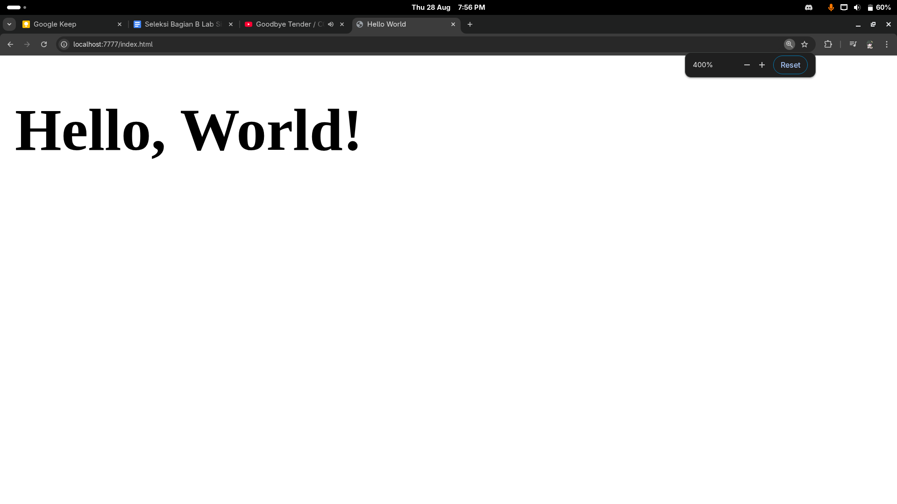
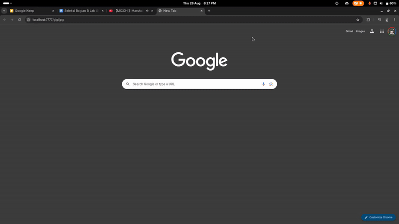
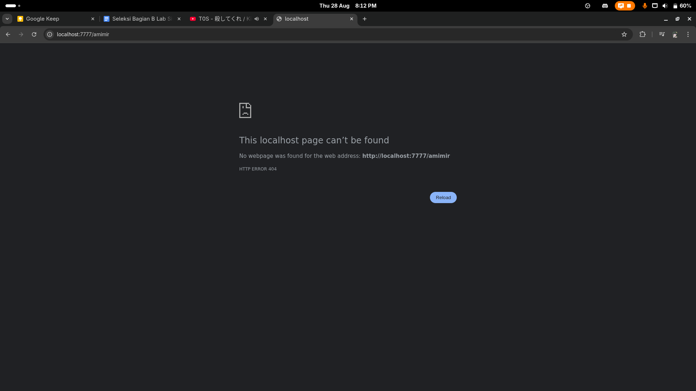
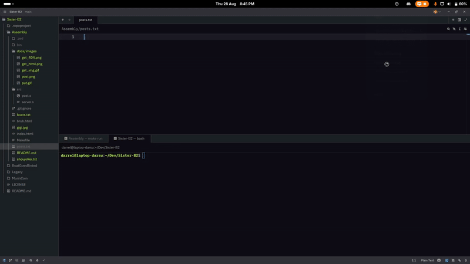
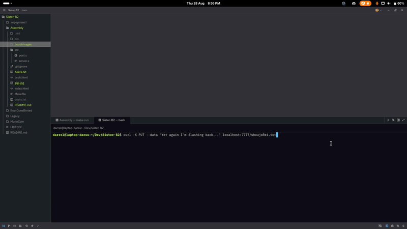
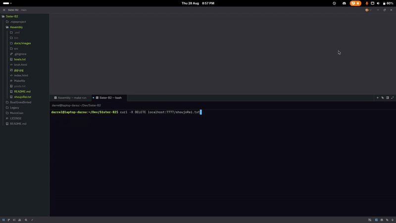

# Sisters, Assemble

Why would you write a web server in assembly...

### GET

- Serves static files (HTML or other files).
- If the file has a `.html` extension, the server sends a `Content-Type: text/html` header.
- Other files are sent as downloads.
- NOTE: Only supports up to 1024 bytes.

**GET HTML**  


**GET Image**


**GET 404**


---

### POST to `/submit`

- Data sent to `/submit` is saved to `posts.txt`.
- Each entry is timestamped (using an external C function).
- Any other POST paths return a 405.

**POST**  


---

### PUT

- Overwrites or creates a file at the requested path.
- NOTE: DOES NOT HAVE ANY SAFEGUARDS.

**PUT**


---

### DELETE

- Deletes the file at the requested path.
- NOTE: ALSO DOES NOT HAVE ANY SAFEGUARDS. This is even worse.

**DELETE**  


---

## How to Build & Run

1. Build the server:
   
   ```
   make build
   ```

2. Run the server:
   
   ```
   make run
   ```

3. Clean build artifacts:
   
   ```
   make clean
   ```
