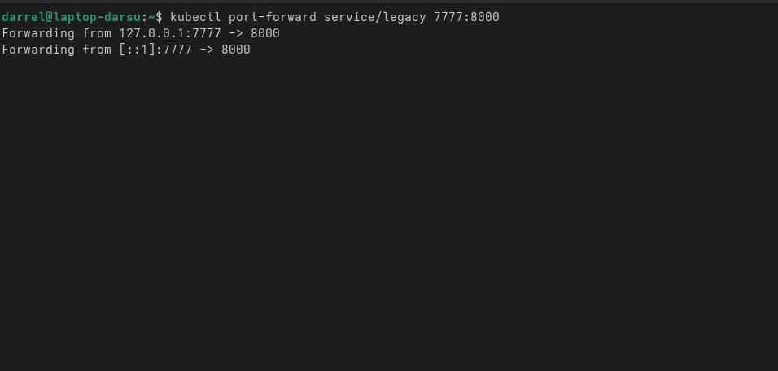
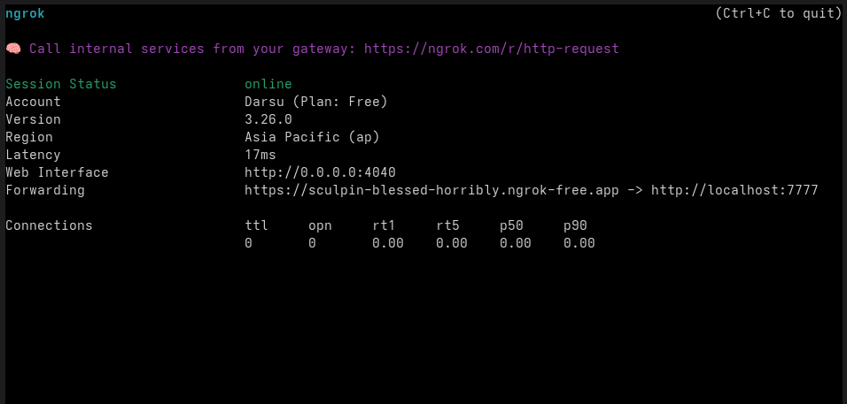
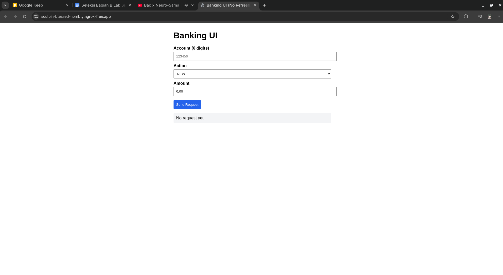
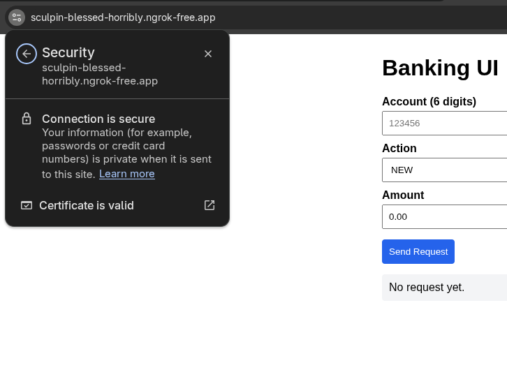

# COBOLstone Ahh

Docker is so finicky man...

| Bonus         | Status                                                                                                                                                                                                                                                                                                                                                                                           |
| ------------- | ------------------------------------------------------------------------------------------------------------------------------------------------------------------------------------------------------------------------------------------------------------------------------------------------------------------------------------------------------------------------------------------------ |
| Conversion    | ❌ I don't get it. When do i do the conversion?                                                                                                                                                                                                                                                                                                                                                   |
| Kubernetes    | ✅ Using minikube (I don't know if this counts) Literally just https://minikube.sigs.k8s.io/docs/start/                                                                                                                                                                                                                                                                                       |
| Interest      | ✅ Using a background task in bash command via Dockerfile and implemented --apply-interest argument in COBOL `while true; do ./main --apply-interest; sleep 23; done & uvicorn app:app --host 0.0.0.0 --port 8000 & wait`  Using this, it serves the main uvicorn app while running ./main --apply-interest every 23 seconds. As for the COBOL, go check the git diff ¯\\\_(ツ)_/¯     |
| Reverse Proxy | ✅ Port forward from Kubernetes then to internet using ngrok. |
| Domain        | ✅ ngrok provides a free domain that serves HTTPS.                                                                                                                                                                                                                                    |
